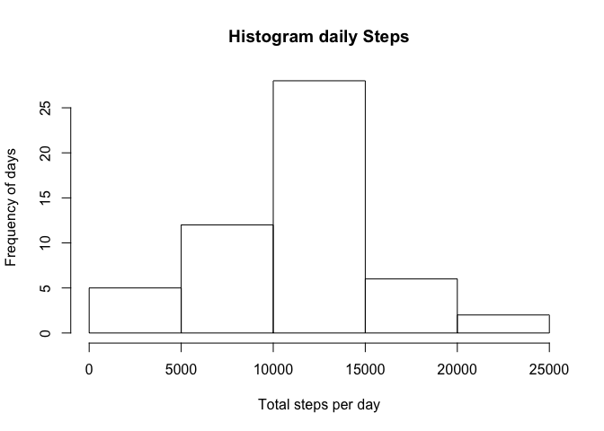
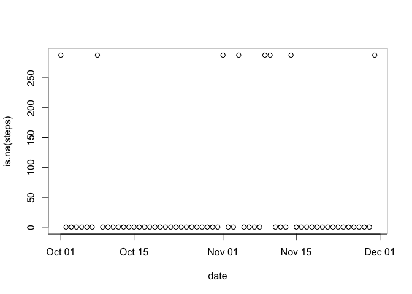
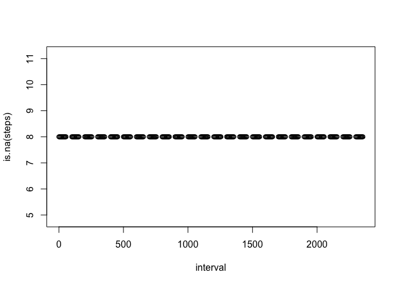
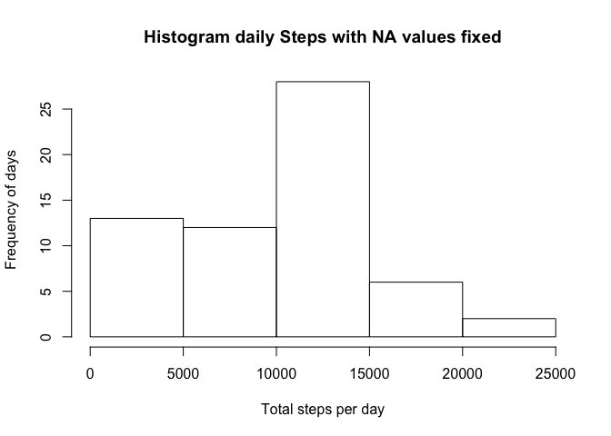
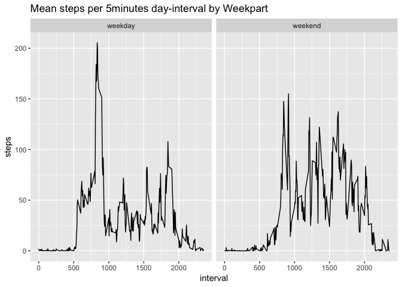

## Loading and preprocessing the data
First we unzip & load the data into df. Then transform the date to its correct data type and remove all NA values:

```r
df<-read.csv(unzip('activity.zip'))
df$date<- as.Date(df$date)
```

## What is mean total number of steps taken per day?
Lets first take a look at the distribution of steps per day across all days:

```r
daily<-aggregate(steps~date,df, sum)
hist(daily$steps,main='Histogram daily Steps',xlab='Total steps per day',ylab='Frequency of days')
```

<!-- -->

the mean of daily steps:

```r
mean(daily$steps)
```

```
## [1] 10766.19
```

the median of daily steps:

```r
median(daily$steps)
```

```
## [1] 10765
```

## What is the average daily activity pattern?
average the steps taken in each 5min-interval across all days:

```r
interv<-aggregate(steps~interval,df,mean)
plot(interv,type="l")
```

<!-- -->

Which 5-minute interval, on average across all the days in the dataset, contains the maximum number of steps?

```r
interv[interv$steps==max(interv$steps),]
```

```
##     interval    steps
## 104      835 206.1698
```
the maximum number of average steps is being taken in interval 835.

## Imputing missing values
The total number of missing values in the dataset:

```r
sum(is.na(df))
```

```
## [1] 2304
```
Which days is data missing?

```r
plot(aggregate(is.na(steps)~date,df,sum))
```

<!-- -->

which interval is data missing?

```r
plot(aggregate(is.na(steps)~interval,df,sum))
```

<!-- -->

Because of each interval 8 values are missing and 8 days of values are missing, we can conclude that data for 8 days is missing completely.

Filling in all of the missing values based on median of same interval:

```r
intervalmedian<-aggregate(steps~interval,df,median) #calculate medians to fill in
dfmissing<-df[is.na(df$steps),2:3] #copy NA values
dfmissing <- (merge(intervalmedian, dfmissing, by = 'interval')) #complete with medians per interval
dfcompleted<-rbind(dfmissing,df[!is.na(df$steps),]) #combine into completed table
```

Make a histogram of the total number of steps taken each day:

```r
hist(aggregate(steps~date,dfcompleted,sum)$steps,main='Histogram daily Steps with NA values fixed',xlab='Total steps per day',ylab='Frequency of days')
```

<!-- -->

Calculate and report the mean and median total number of steps taken per day.
the mean of daily steps - with NA values fixed:

```r
mean(aggregate(steps~date,dfcompleted,sum)$steps)
```

```
## [1] 9503.869
```

the median of daily steps - with NA values fixed:

```r
median(aggregate(steps~date,dfcompleted,sum)$steps)
```

```
## [1] 10395
```
both values decreased because of outliers increasing the mean while the median stays relatively low. Filling in NA values based on median values has a normalizing effect. 

## Are there differences in activity patterns between weekdays and weekends?
Create a new factor variable in the dataset with two levels – “weekday” and “weekend” indicating whether a given date is a weekday or weekend day.

```r
dfcompleted$weekpart<-weekdays(dfcompleted$date,abbr=T) #add a column with abbreviated weekdays
dfcompleted$weekpart[dfcompleted$weekpart %in% c("Sat", "Sun")]<-"weekend" #replace sat&sun
dfcompleted$weekpart[dfcompleted$weekpart !="weekend"]<-"weekday" #replace the rest
dfcompleted$weekpart<-as.factor(dfcompleted$weekpart) #make factor
```

Make a panel plot to visualize mean steps per interval by weekpart:

```r
library(ggplot2)
g<-ggplot(dfcompleted,aes(interval,steps))
g+facet_grid(rows = dfcompleted$weekpart)+stat_summary(aes(group=weekpart), fun.y=mean, geom="line")+labs(title="Mean steps per 5minutes day-interval by Weekpart")
```

<!-- -->
